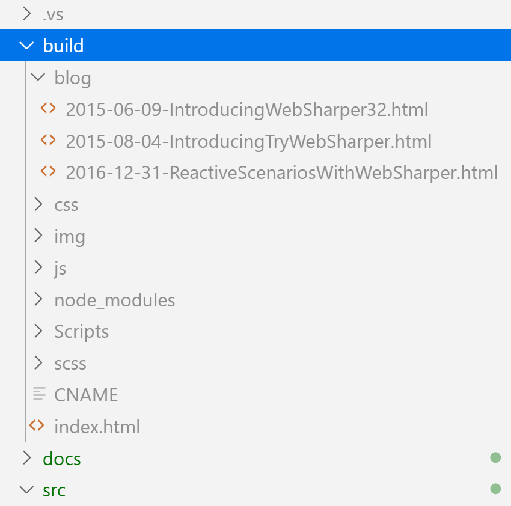

# SiteFi - your F# static site generator


SiteFi is a simple and highly configurable static site generator for F#. It uses [WebSharper](https://websharper.com) to build the pages of your website and to generate HTML files for them.

## Key features

 * Add your Markdown articles and build, no coding is necessary
 * Get a full, standalone HTML blog, ready to deploy
 * Write in multiple languages, and get a language selector and main pages for each
 * Tag your articles with categories, and get listing pages for each
 * Have multiple authors? No problem! Each get a separate folder for articles.
 * RSS 2.0 and Atom 1.0 feeds
 * Syntax highlighting for F# code blocks
 * Develop dynamic articles in F#, with charts, visualizations, etc.
 * Streamlined workflow for template changes (style, layout, etc.) - see effects immediately, and only rebuild when you are done

# 1. Configuring your blog

The main configuration file is located in `src\Hosted\config.yml`. Use this file to configure various site-wide aspects such as the URL you are deploying your blog to, your name, the default language for your articles, and RSS/Atom feed info.

```text
serverUrl: http://mywebsite.com
shortTitle: My Blog
title: My F# Blog
description: My ramblings and experiences with building stuff with F#
masterUsername: My Name
masterLanguage: en
languages: "en->English,es->Spanish,hu->Hungarian"
users: "extra1->My Friend's Name"
```

| Property      | What it is |
|:------------- |:--------------|
| `serverUrl`   | The URL the site will be deployed under. *Default*: `"http://localhost:5000"` (the port used by the `Hosted` project.) |
| `shortTitle`  | The title of the site, used in the main navigation bar. *Default*: `"My Blog"`|
| `title`       | The title of the home page and the RSS/Atom feeds. *Default*: `"My F# Blog"`|
| `description` | The description of the site, used in the RSS/Atom feeds. *Default*: `"TODO: write the description of this blog"`|
| `masterUserDisplayName` | The default user's display name. Set this to your name, your company name, or whatever. *Default*: `"My Name"`|
| `masterLanguage` | The default language. Use a key value, such as `"en"`. Languages won't show up until you start using at least two languages. *Default*: `"en"` |
| `languages`      |  A comma-separated list of mappings from language keys to display names. *Default*: `"en->English"` |
| `users`      |  A comma-separated list of mappings from usernames to display names. Usernames correspond to subfolders under the main posts directory. *Default*: `"jsmith->John Smith"` |

# 2. Building and running your blog

1) Run `.\install.ps` - do this the first time you start working with this repository. This script installs the required JS/CSS resources (only Bulma at the moment) and a convenient HTML server, `dotnet-serve` to serve the output.

2) In the root folder, run `"dotnet build"` - this builds the entire solution, and among others generates your HTML files in the top-level `build` folder, ready to deploy elsewhere. That folder will look something like the following, ready to deploy to your web server:

   

   Alternatively, you can also "run" your site without static file generation by running the `src\Hosted` project with `"dotnet run -p src\Hosted\Hosted.fsproj"`. This starts your website on `http://localhost:5000`, by default.

3) (Optional) Run `.\serve.cmd` to preview your generated HTML files - this invokes `dotnet-serve` on the `build` folder so you can view your blog articles in the browser (by default at `http://localhost:56001`). You can change the port, if needed in the script.

## Cleaning your generated files

You can clean your solution with `"dotnet clean"` from the root folder: this removes all generated artifacts, including the `build` folder.

# 3. Writing your articles

The markdown files for your articles are in `src\Hosted\posts`. Add your `.md` files to this folder with the naming convention `YYYY-MM-DD-YourArticleTitle.md`. Give at least the title in the YAML header, as follows:

```
---
title: A wonderful F# journey
subtitle: The best path to getting my F# blog up and running
...
---
```
You can use the following properties:

| Property      | What it is |
|:------------- |:--------------|
| `title`       | The title of the article. |
| `subtitle`    | The subtitle of the article. |
| `abstract`    | A brief description of the article. |
| `url`         | *This is unused.* |
| `content`     | The content of the article, usually very short, otherwise use the article body. |
| `date`        | The date of the article, overriding the date given through the filename. |
| `categories`  | The comma-separated list of categories/tags of the article. |
| `language`    | The language code of the article. You can map these to language labels in `config.yml`.|

Remember to rebuild `src\Website` after each change and/or new article to get the matching HTML output. Or alternatively, use/run the `src/Hosted` project to enable near-live edits - see below for more details.

## Multilingual articles

As listed above, you can use the `language` property in your article header to mark the language for that article. You can use any key you prefer for this, such as `"en"`, `"eng"`, etc. The sum of all keys (case sensitive) in your articles makes up the language list used in your site. The master language can be configured in `config.yml` under `masterLanguage`, which specifies the default language key for articles that otherwise might be missing the `language` property.

By default, if all articles use the same language, matching `masterLanguage`, no language selector is rendered. Otherwise, a language selector widget is built from the languages used in the articles by taking their language keys and mapping them to display names using the `languages` setting in `config.yml`.

## Multiple authors

By default, the `src\Hosted\posts` folder contains the master user's articles. You can add articles by additional authors into subfolders, and you can configure their display names by setting `users` in `config.yml`.

For instance, if you have three additional authors in your blog organization next to the master author, the posts folder might look like the following:

```text
posts
   |-- john
       2020-01-01-HappyNewYear.md
   |-- fred
       2020-02-11-WhyFSharpRocks.md
   |-- bill
       2020-01-04-UsingVisualStudioCode.md
   2020-01-15-WebSharperSPAs.md
```

These users can then be configured in `config.yml` as:

```yaml
...
masterUserDisplayName: Adam Smith
users: "john->John Smith,fred->Fred Smith,bill->Bill Smith"
```

# Solution structure

The repository provides a general blueprint to structure your static blog application, and without any changes is able to generate a static blog from a list of blog articles written in the markdown format.

There are three projects in this repository that you can use to further develop the built-in sample blog to your needs:

 * `src\Client` - this contains client-side functionality (to be run as JavaScript code) that you intend to embed in all (or some) of the output HTML pages. `Client` is a WebSharper+F# project and uses WebSharper to generate transpiled JavaScript code. Currently, this project consists of a single `Main.fs` file that enables F# syntax highlighting for markdown code blocks, and hides/shows the responsive drawer menu in the generated pages on mobile devices.

 * `src\Hosted` - this is a WebSharper client-server and an ASP.NET Core application. You can run it to self-host your blog and work with template/style/layout changes much more effectively without having to recompile on each update. Simply deploy, make changes to `index.html` in the root of the project, and refresh your page in your browser. You can also author your blog articles and see them in their rendered form by triggering a runtime update URL (see below.)

 * `src\Website` - this is a dummy WebSharper offline sitelet project that uses the code from `src\Hosted` and generates HTML pages in the `\build` root folder. It also copies all related artifacts (CSS, JS, images, etc.) into this folder, making it self-contained and ready to deploy in GitHub Pages or any other HTML server.

# Extending your blog website

The default blog is represented in `\src\Hosted\Main.fs` as follows:

```fsharp
type EndPoint =
    | [<EndPoint "GET /">] Home
    | [<EndPoint "GET /blog">] Article of slug:string
```

If you need other pages, such as an About page or a set of documentation pages, you can add further shapes to this type and enhance `Site.Main` accordingly.

# Making template changes

I recommend you run the `src\Hosted` project if you intend to make template/layout/style changes. By default, the master template (`index.html`) is used in such a way that updates to this file are reflected runtime, i.e. without requiring recompilation (unless you change the bindings/placeholders, in which case you need to recompile and adapt your `Main.fs` accordingly), significantly speeding up your development workflow.

You can run the hosted project as opposed to `src/Website` in Visual Studio by making it your default project and running it, and in Visual Studio Code (or in any terminal) by running (from the root folder):

```
dotnet run --project src\Hosted\Hosted.fsproj
```

By default, the hosted application is deployed to `localhost:5000`, note the different port here.

When you change existing blog articles or add new ones, you need to reload their markdown files. I have added a sitelet endpoint to trigger this:

```fsharp
type EndPoint =
    ...
    | [<EndPoint "GET /refresh">] Refresh
```

You can simply go to `http://localhost:5000/refresh`, and reload your article to reflect any changes you made to it while the hosted blog has been running.

Have fun writing your blog with SiteFi!

# RSS and Atom feeds

By default, an RSS and Atom feed is generated automatically for your blog, both in the statically generated site and the self-hosted one. The URLs are `/feed.rss` and `/feed.atom` in both cases. In the statically generated site under `build`, you might need to configure your web server to serve these files with the correct MIME types, see your web server configuration for more details.

# Appendix - Image credit

* `src\Hosted\img\Banner.jpg` by Plush Design Studio on Unsplash - https://unsplash.com/photos/UHqfUTDmdC4

